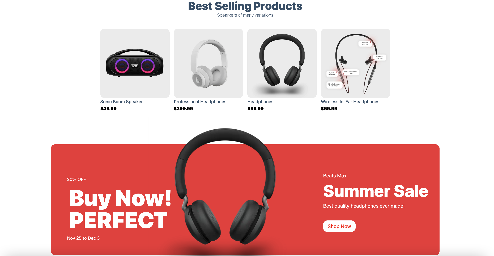

# Electronic eCommerce Store!

I created this eCommerce store to build and practice my React skills, with a functional ecommerce store with Stripe functionalitity! Easily customizable with any products, and build in cart to track and buy the products! 

**Link to project:** https://ecomm-mussina123.vercel.app/

 

## How It's Made:

**Tech used:** React, Nextjs, Stripe, HTML, CSS

This website was build using Nextjs on top of React to build a smooth and quick eCommerce website. Full product pages with description, rating, price, add to cart and buy now button! Stripe integration was used to emulate a real eCommerce website with full functionality. 

## Optimizations

I created this project with full functionality of a typical eCommerce site. With more time, there would be many optimizations I would love to do!

Future optimizations include: 

- User login page, which would keep track of past orders, billing/shipping information, using proper authorization. 
- Expanind the homepage of the site to include many more products and product categories! 

## Lessons Learned:

More practice with React hooks and managing of state/props!
